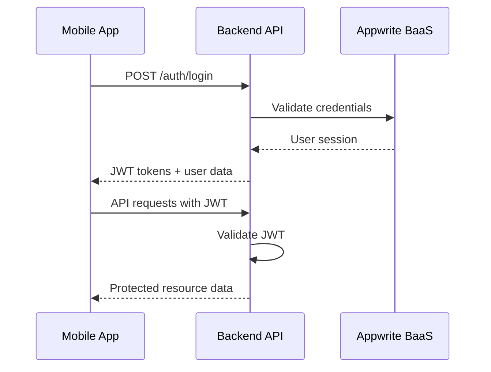

# 🧠 Mindspace Backend

> **Confidential & Proprietary** - Mental Health Platform Backend

A high-performance, scalable backend API built with Bun, Elysia.js, and clean architecture principles to power the Mindspace mental health application ecosystem.

---

## 🔍 Overview

The Mindspace Backend is a comprehensive REST API service that provides secure, HIPAA-compliant infrastructure for mental health data management, user authentication, AI-powered insights, and seamless integration with healthcare platforms.

### **Core Capabilities**

- **🔐 Secure Authentication** with JWT, OAuth2, and biometric support
- **📊 Mental Health Data Management** for journals, moods, and analytics
- **🤖 AI-Powered Insights** using Google Gemini for sentiment analysis
- **🏥 Healthcare Integration** with company/therapist portals
- **📱 Real-time Communication** with mobile and web clients
- **🛡️ HIPAA Compliance** with encrypted data storage and audit trails

---

## 🧰 Tech Stack

### **Runtime & Framework**
- **[Bun](https://bun.sh)** `v1.2.18+` - Ultra-fast JavaScript runtime and package manager
- **[Elysia.js](https://elysiajs.com/)** `^1.0.0` - High-performance web framework built for Bun
- **[TypeScript](https://www.typescriptlang.org/)** `^5.3.0` - Type-safe JavaScript with full ES2023 support

### **Backend as a Service (BaaS)**
- **[Appwrite](https://appwrite.io/)** `^14.0.0` - Backend-as-a-Service for database, auth, and storage
- **[Node Appwrite](https://github.com/appwrite/sdk-for-node)** `^17.1.0` - Server-side Appwrite SDK

### **AI & Machine Learning**
- **[Google Generative AI](https://ai.google.dev/)** `^0.24.1` - Google Gemini API for sentiment analysis and insights
- **AI-Powered Features**: Mood pattern recognition, journal sentiment analysis, personalized recommendations

### **Authentication & Security**
- **[JWT](https://jwt.io/)** `^9.0.2` - JSON Web Tokens for secure session management
- **[bcryptjs](https://github.com/dcodeIO/bcrypt.js)** `^2.4.3` - Password hashing and encryption
- **[Rate Limiter](https://github.com/animir/node-rate-limiter-flexible)** `^5.0.0` - API rate limiting and DDoS protection

### **API Documentation & Validation**
- **[Swagger/OpenAPI](https://swagger.io/)** `^1.0.0` - Comprehensive API documentation
- **[Zod](https://zod.dev/)** `^3.22.0` - Runtime type validation and schema definitions

### **Communication & Notifications**
- **[Nodemailer](https://nodemailer.com/)** `^7.0.5` - Email delivery system
- **[Winston](https://github.com/winstonjs/winston)** `^3.11.0` - Advanced logging and monitoring

### **Development & Quality**
- **[TypeScript](https://www.typescriptlang.org/)** - Static type checking
- **[ESLint](https://eslint.org/)** - Code quality and style enforcement
- **[Jest](https://jestjs.io/)** - Unit and integration testing

---

## 🌐 API Endpoints

### **Authentication**
| Method | Endpoint | Description | Auth Required |
|--------|----------|-------------|---------------|
| `POST` | `/api/v1/auth/register` | User registration | ❌ |
| `POST` | `/api/v1/auth/login` | User authentication | ❌ |
| `POST` | `/api/v1/auth/logout` | User logout | ✅ |
| `GET` | `/api/v1/auth/profile` | Get user profile | ✅ |
| `PATCH` | `/api/v1/auth/update-profile` | Update user profile | ✅ |
| `POST` | `/api/v1/auth/change-password` | Change password | ✅ |
| `POST` | `/api/v1/auth/forgot-password` | Request password reset | ❌ |
| `POST` | `/api/v1/auth/reset-password` | Reset password with token | ❌ |
| `POST` | `/api/v1/auth/refresh-token` | Refresh JWT token | ✅ |
| `POST` | `/api/v1/auth/verify-email` | Verify email address | ❌ |

### **OAuth 2.0**
| Method | Endpoint | Description | Auth Required |
|--------|----------|-------------|---------------|
| `POST` | `/api/v1/auth/oauth2/initiate` | Initiate OAuth flow | ❌ |
| `GET` | `/api/v1/auth/oauth2/callback` | Handle OAuth callback | ❌ |

### **Journal Management**
| Method | Endpoint | Description | Auth Required |
|--------|----------|-------------|---------------|
| `POST` | `/api/v1/journal` | Create journal entry | ✅ |
| `GET` | `/api/v1/journal` | Get user journal entries | ✅ |
| `GET` | `/api/v1/journal/:id` | Get specific journal entry | ✅ |
| `PATCH` | `/api/v1/journal/:id` | Update journal entry | ✅ |
| `DELETE` | `/api/v1/journal/:id` | Delete journal entry | ✅ |
| `GET` | `/api/v1/journal/search` | Search journal entries | ✅ |
| `GET` | `/api/v1/journal/export` | Export journal data | ✅ |

### **Mood Tracking**
| Method | Endpoint | Description | Auth Required |
|--------|----------|-------------|---------------|
| `POST` | `/api/v1/mood` | Record mood entry | ✅ |
| `GET` | `/api/v1/mood` | Get mood history | ✅ |
| `GET` | `/api/v1/mood/trends` | Get mood trends | ✅ |
| `GET` | `/api/v1/mood/statistics` | Get mood statistics | ✅ |
| `DELETE` | `/api/v1/mood/:id` | Delete mood entry | ✅ |

### **AI Insights**
| Method | Endpoint | Description | Auth Required |
|--------|----------|-------------|---------------|
| `POST` | `/api/v1/ai/analyze-journal` | Analyze journal with AI | ✅ |
| `GET` | `/api/v1/ai/insights` | Get AI-generated insights | ✅ |
| `POST` | `/api/v1/ai/mood-prediction` | Predict mood patterns | ✅ |
| `GET` | `/api/v1/ai/recommendations` | Get personalized recommendations | ✅ |

### **Company/Therapist Portal**
| Method | Endpoint | Description | Auth Required |
|--------|----------|-------------|---------------|
| `POST` | `/api/v1/company/register` | Register company | ❌ |
| `GET` | `/api/v1/company/profile` | Get company profile | ✅ |
| `GET` | `/api/v1/company/users` | Get company users | ✅ |
| `GET` | `/api/v1/company/analytics` | Get company analytics | ✅ |
| `POST` | `/api/v1/company/invite-user` | Invite user to company | ✅ |

**📎 [Complete API Documentation](./docs/current/api/README.md)**

---

## 🧱 Architecture & Design

### **Clean Architecture Pattern**

```
📡 Presentation Layer (Routes & Controllers)
    ↓
🎮 Application Layer (Services & Use Cases)
    ↓
🏗️ Domain Layer (Entities & Business Rules)
    ↓
🔧 Infrastructure Layer (Database & External APIs)
```

### **Key Design Principles**

#### **1. Dependency Injection**
```typescript
// Service Container Pattern
const container = new ServiceContainer();
container.register(SERVICE_KEYS.AUTH_SERVICE, () => 
  new AuthService(
    getService(SERVICE_KEYS.DATABASE_SERVICE),
    getService(SERVICE_KEYS.EMAIL_SERVICE)
  )
);
```

#### **2. Repository Pattern**
```typescript
interface IAuthService {
  register(userData: RegisterRequest): Promise<AuthResponse>;
  login(credentials: LoginRequest): Promise<AuthResponse>;
  refreshToken(token: string): Promise<TokenResponse>;
}
```

#### **3. Middleware Architecture**
```typescript
// Authentication Middleware
.use(authMiddleware())
.guard(permissions(['manage_profile']))
```

#### **4. Error Handling Strategy**
```typescript
// Centralized Error Management
class BusinessError extends Error {
  constructor(message: string, public code: string) {
    super(message);
  }
}
```

**📎 [Detailed Architecture Documentation](./docs/current/architecture/README.md)**

---

## 🔐 Authentication & Authorization

### **Multi-Factor Authentication**
- **JWT Tokens** with RS256 signing
- **Refresh Token Rotation** for enhanced security
- **OAuth 2.0** integration (Google, Facebook, Apple)
- **Biometric Authentication** support for mobile apps

### **Role-Based Access Control (RBAC)**
```typescript
// Permission System
enum UserRole {
  INDIVIDUAL_USER = 'INDIVIDUAL_USER',
  COMPANY_ADMIN = 'COMPANY_ADMIN',
  THERAPIST = 'THERAPIST',
  SUPER_ADMIN = 'SUPER_ADMIN'
}

const permissions = {
  INDIVIDUAL_USER: ['manage_profile', 'create_journal', 'view_insights'],
  COMPANY_ADMIN: ['manage_company', 'view_company_analytics', 'invite_users'],
  THERAPIST: ['view_patient_data', 'create_assessments', 'manage_sessions']
};
```

### **Security Features**
- **Rate Limiting** - API endpoint protection
- **CORS Configuration** - Cross-origin request security
- **Input Validation** - Zod schema validation
- **SQL Injection Prevention** - Parameterized queries
- **XSS Protection** - Content Security Policy headers

---

## 🏗️ Setup & Running Instructions

### **Prerequisites**
- **Bun** >= 1.2.18 ([Install Bun](https://bun.sh/docs/installation))
- **Node.js** >= 18.0.0 (for compatibility)
- **Appwrite** instance (cloud or self-hosted)
- **Google AI API** key for AI features

### **Installation**

#### **1. Clone Repository**
```bash
git clone <repository-url>
cd backend
```

#### **2. Install Dependencies**
```bash
# Install with Bun (recommended)
bun install

# Alternative: npm/yarn
npm install
```

#### **3. Environment Configuration**
```bash
# Copy environment template
cp .env.example .env
```

Configure your `.env` file:
```env
# Server Configuration
PORT=3000
NODE_ENV=development
API_VERSION=v1

# Appwrite Configuration
APPWRITE_ENDPOINT=https://nyc.cloud.appwrite.io/v1
APPWRITE_PROJECT_ID=your_project_id
APPWRITE_API_KEY=your_api_key
APPWRITE_DATABASE_ID=your_database_id

# JWT Configuration
JWT_SECRET=your_super_secure_jwt_secret
JWT_REFRESH_SECRET=your_refresh_token_secret
JWT_ACCESS_EXPIRE=15m
JWT_REFRESH_EXPIRE=7d

# Google AI Configuration
GOOGLE_AI_API_KEY=your_google_ai_api_key

# Email Configuration (Optional)
EMAIL_HOST=smtp.gmail.com
EMAIL_PORT=587
EMAIL_USER=your_email@gmail.com
EMAIL_PASSWORD=your_app_password

# Logging
LOG_LEVEL=info
LOG_FILE=logs/app.log
LOG_ERROR_FILE=logs/app-error.log
```

#### **4. Database Setup**
```bash
# Setup Appwrite collections and indexes
bun run setup-appwrite-collections.js

# Alternative: Manual setup
# Visit your Appwrite console and create collections as per schema
```

### **Development**

#### **Start Development Server**
```bash
# Start with hot reload
bun run dev

# Start production build
bun run start

# Type checking
bun run type-check
```

#### **Development Tools**
```bash
# Run tests
bun test

# Watch mode testing
bun run test:watch

# Build for production
bun run build

# Linting
bun run lint
```

### **Production Deployment**

#### **Docker Deployment**
```dockerfile
FROM oven/bun:1-alpine

WORKDIR /app
COPY package.json bun.lockb ./
RUN bun install --frozen-lockfile

COPY . .
RUN bun run build

EXPOSE 3000
CMD ["bun", "run", "start"]
```

#### **Environment Variables for Production**
```env
NODE_ENV=production
PORT=3000
LOG_LEVEL=warn

# Use production Appwrite instance
APPWRITE_ENDPOINT=https://your-production-appwrite.com/v1

# Strong JWT secrets (use random generators)
JWT_SECRET=your_production_jwt_secret_256_bits
JWT_REFRESH_SECRET=your_production_refresh_secret_256_bits

# Production email service
EMAIL_HOST=your_production_smtp_host
```

---

## 🛠️ Environment Variables

### **Required Variables**

| Variable | Description | Example |
|----------|-------------|---------|
| `PORT` | Server port | `3000` |
| `NODE_ENV` | Environment | `development` |
| `APPWRITE_ENDPOINT` | Appwrite server URL | `https://nyc.cloud.appwrite.io/v1` |
| `APPWRITE_PROJECT_ID` | Appwrite project ID | `mindspace-prod` |
| `APPWRITE_API_KEY` | Appwrite API key | `your_api_key` |
| `JWT_SECRET` | JWT signing secret | `your_secret_key` |

### **Optional Variables**

| Variable | Description | Default |
|----------|-------------|---------|
| `LOG_LEVEL` | Logging level | `info` |
| `EMAIL_HOST` | SMTP host | `smtp.gmail.com` |
| `GOOGLE_AI_API_KEY` | Google AI API key | - |
| `RATE_LIMIT_WINDOW` | Rate limit window (ms) | `900000` |
| `RATE_LIMIT_MAX` | Max requests per window | `100` |

---

## 📂 Folder Structure

```
src/
├── bootstrap.ts                    # Application bootstrap and initialization
├── index.ts                       # Main application entry point
├── controllers/                   # Route handlers and request/response logic
│   ├── AuthController.ts         # Authentication endpoints
│   ├── JournalController.ts      # Journal management
│   ├── MoodController.ts         # Mood tracking
│   ├── AIController.ts           # AI insights and analysis
│   ├── CompanyController.ts      # Company/therapist portal
│   └── BaseController.ts         # Base controller with common functionality
├── core/                         # Core business logic and architecture
│   ├── container/               # Dependency injection container
│   │   └── ServiceContainer.ts  # Service registration and resolution
│   ├── domain/                  # Domain entities and business rules
│   │   ├── User.ts             # User domain entity
│   │   └── Permission.ts       # Permission and role management
│   ├── interfaces/              # Service contracts and interfaces
│   │   ├── IAuthService.ts     # Authentication service interface
│   │   ├── IDatabaseService.ts # Database service interface
│   │   ├── IAIService.ts       # AI service interface
│   │   └── index.ts            # Interface exports
│   ├── middleware/              # Request processing middleware
│   │   ├── AuthenticationMiddleware.ts  # JWT authentication
│   │   └── PermissionGuard.ts          # RBAC permission checking
│   ├── providers/               # Service provider implementations
│   │   ├── AppwriteServiceProvider.ts  # Appwrite service setup
│   │   └── BusinessServiceProvider.ts  # Business logic services
│   └── services/                # Core business services
│       └── PermissionService.ts # Permission and role management
├── models/                      # Data models and entities
│   ├── UserModel.ts            # User data model
│   ├── JournalModel.ts         # Journal entry model
│   ├── MoodModel.ts            # Mood tracking model
│   ├── CompanyModel.ts         # Company/organization model
│   └── BaseModel.ts            # Base model with common fields
├── routes/                     # API route definitions
│   ├── auth.ts                # Authentication routes
│   ├── journal.ts             # Journal management routes
│   ├── mood.ts                # Mood tracking routes
│   ├── ai.ts                  # AI insights routes
│   └── company.ts             # Company portal routes
├── services/                   # External service implementations
│   ├── auth/                  # Authentication adapters
│   │   └── AppwriteAuthAdapter.ts     # Appwrite auth implementation
│   ├── database/              # Database adapters
│   │   └── AppwriteDatabaseAdapter.ts # Appwrite database implementation
│   ├── storage/               # File storage adapters
│   │   └── AppwriteStorageAdapter.ts  # Appwrite storage implementation
│   ├── CompanyService.ts      # Company management service
│   ├── EmailService.ts        # Email notification service
│   ├── GeminiAIService.ts     # Google Gemini AI service
│   └── NotificationService.ts # Push notification service
├── types/                     # TypeScript type definitions
│   └── index.ts              # Common type definitions
└── utils/                     # Utility functions and helpers
    ├── BusinessError.ts       # Custom error classes
    ├── OAuth2ErrorHandler.ts # OAuth error handling
    ├── config.ts             # Configuration management
    ├── jwt.ts                # JWT token utilities
    ├── logger.ts             # Logging configuration
    ├── permissions.ts        # Permission helper functions
    ├── response.ts           # Standard API response formatting
    ├── validation.ts         # Input validation schemas
    └── __tests__/            # Utility function tests
```

**📎 [Detailed Folder Structure Guide](./docs/current/guides/DEVELOPMENT.md#folder-structure)**

---

## 🧪 Testing Instructions

### **Running Tests**
```bash
# Run all tests
bun test

# Run tests in watch mode
bun run test:watch

# Run specific test file
bun test src/services/AuthService.test.ts

# Generate coverage report
bun test --coverage
```

### **Test Categories**

#### **Unit Tests**
```typescript
// Example: Service layer testing
describe('AuthService', () => {
  it('should register new user successfully', async () => {
    const authService = new AuthService(mockDatabase, mockEmail);
    const result = await authService.register(validUserData);
    
    expect(result.success).toBe(true);
    expect(result.data.user.email).toBe(validUserData.email);
  });
});
```

#### **Integration Tests**
```typescript
// Example: API endpoint testing
describe('POST /api/v1/auth/register', () => {
  it('should create new user account', async () => {
    const response = await app
      .handle(new Request('http://localhost/api/v1/auth/register', {
        method: 'POST',
        headers: { 'Content-Type': 'application/json' },
        body: JSON.stringify(userData)
      }));

    expect(response.status).toBe(201);
  });
});
```

### **Test Structure**
```
__tests__/
├── unit/                    # Unit tests
│   ├── services/           # Service layer tests
│   ├── utils/              # Utility function tests
│   └── domain/             # Domain logic tests
├── integration/            # Integration tests
│   ├── api/               # API endpoint tests
│   └── database/          # Database integration tests
└── fixtures/              # Test data and mocks
```

---

## 🔗 Frontend Integration Notes

### **API Client Configuration**
The backend provides a comprehensive REST API that integrates seamlessly with the React Native mobile app:

```typescript
// Frontend API client configuration
const apiClient = {
  baseURL: process.env.EXPO_PUBLIC_API_URL || 'http://localhost:3000',
  headers: {
    'Content-Type': 'application/json',
    'Authorization': `Bearer ${accessToken}`
  }
};
```

### **Authentication Flow**


### **Real-time Data Sync**
- **Optimistic Updates** - Frontend updates UI immediately
- **Background Sync** - Periodic data synchronization
- **Conflict Resolution** - Server-side conflict handling
- **Offline Support** - Cached data with sync on reconnection

**📎 [Frontend Documentation](../mindspace/README.md)**

---

## 🚧 Known Issues & TODOs

### **Current Limitations**

#### **Performance Optimizations**
- [ ] **Database Query Optimization** - Implement query result caching
- [ ] **API Response Compression** - Add gzip compression middleware
- [ ] **Connection Pooling** - Optimize Appwrite connection management

#### **Feature Enhancements**
- [ ] **Real-time Notifications** - WebSocket implementation for live updates
- [ ] **Advanced AI Insights** - Enhanced machine learning models
- [ ] **Data Export Tools** - Comprehensive data export functionality
- [ ] **Audit Logging** - Complete user activity audit trail

#### **Security Improvements**
- [ ] **API Versioning** - Implement comprehensive API versioning strategy
- [ ] **Enhanced Rate Limiting** - IP-based and user-based rate limiting
- [ ] **Security Headers** - Additional security headers implementation

### **Roadmap Features**
- **GraphQL API** - Alternative to REST for complex queries
- **Microservices Architecture** - Split monolith into focused services
- **Message Queue Integration** - Async processing with Redis/RabbitMQ
- **Advanced Analytics** - Business intelligence and reporting dashboard

---

## 📄 License

**© 2025 Mindspace Technologies. All Rights Reserved.**

This project is **proprietary and confidential**. Unauthorized copying, distribution, modification, or use of any part of this codebase is **strictly prohibited**.

**This software contains:**
- Proprietary mental health data processing algorithms
- Confidential healthcare integrations and compliance frameworks
- Protected AI models and machine learning implementations
- Sensitive authentication and security infrastructure

**Restrictions:**
- No part of this code may be reproduced or transmitted in any form
- Reverse engineering, decompilation, or disassembly is prohibited
- Commercial use or redistribution requires explicit written permission
- All development must comply with HIPAA and healthcare data protection standards
- Access requires signed confidentiality and non-disclosure agreements

**For licensing inquiries or permissions, contact:**
📧 **legal@mindspace.com**
🌐 **https://mindspace.com/licensing**

---

## 📢 Confidentiality Notice

⚠️ **PROPRIETARY & CONFIDENTIAL - HEALTHCARE DATA**

This backend system processes sensitive mental health information and must comply with strict healthcare data protection regulations including HIPAA, GDPR, and other applicable privacy laws.

**All contributors must:**

1. **Sign HIPAA Business Associate Agreements** before accessing any healthcare data
2. **Implement data encryption** for all sensitive information at rest and in transit
3. **Follow security protocols** for authentication, authorization, and audit logging
4. **Report security incidents** immediately to the compliance team
5. **Maintain strict confidentiality** of all user data, business logic, and system architecture
6. **Use approved development environments** with security monitoring and compliance controls

**Critical Compliance Contacts:**
- **Security Team:** 🔒 **security@mindspace.com**
- **Compliance Officer:** ⚖️ **compliance@mindspace.com**
- **HIPAA Administrator:** 🏥 **hipaa@mindspace.com**

---

## 🔗 Related Documentation

- **📎 [Frontend Mobile App](../mindspace/README.md)** - React Native client implementation
- **📎 [API Documentation](./docs/current/api/README.md)** - Complete endpoint reference
- **📎 [Architecture Guide](./docs/current/architecture/README.md)** - System design and patterns
- **📎 [Development Guide](./docs/current/guides/DEVELOPMENT.md)** - Development workflows and best practices
- **📎 [Setup Guide](./docs/current/guides/SETUP.md)** - Detailed installation and configuration
- **📎 [Feature Status](./docs/current/reference/FEATURES.md)** - Implementation progress and roadmap

---

**Built with ⚡ Bun and ❤️ for secure, scalable mental health technology.**

---

*Last Updated: January 2025*